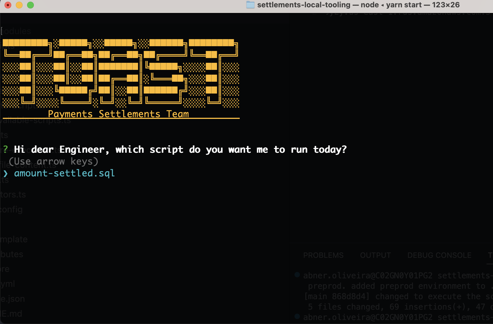
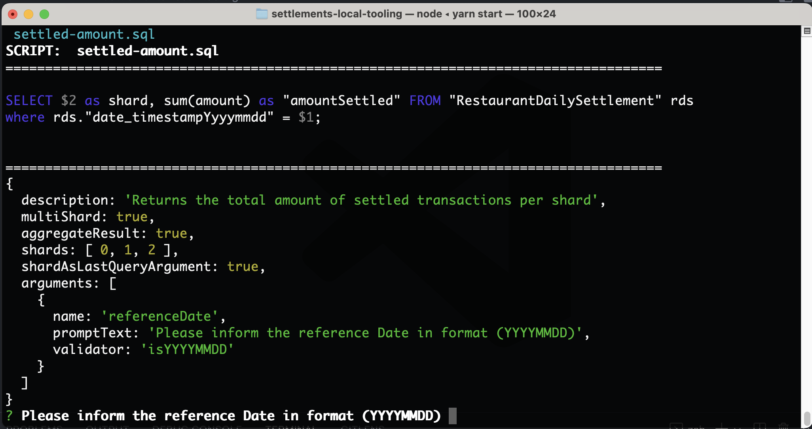
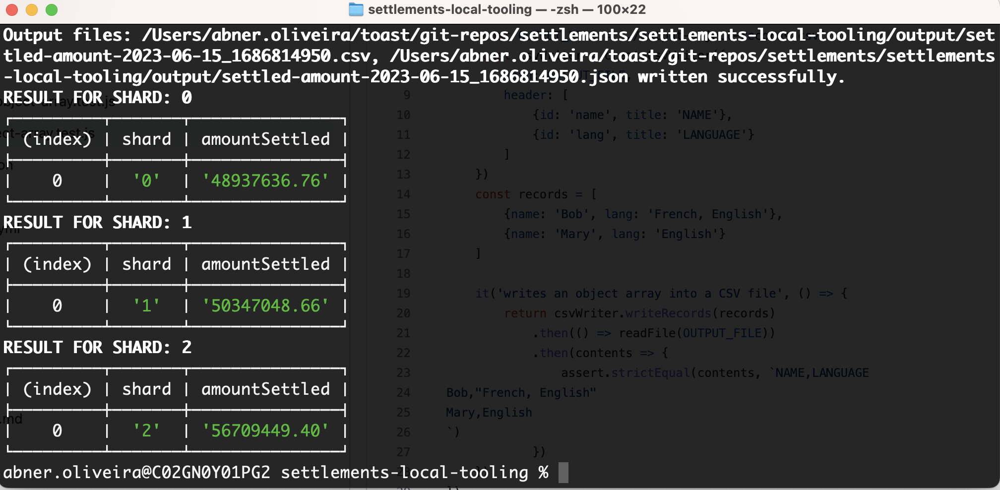

# settlements-local-tooling

Experimental app with some local (UI and console) tooling for the settlements team

The idea is provide a quick way to experiment locally with tooling to automate some of the
day by day tasks of Settlements Team Engineers, allows a quick experimentation and a fast and secure way
to share scripts and other toolings which would help us with our day by day tasks.

## Prototype Solution

### 1. Tooling for execute a given sql query against all the shards which contains CHASE or WORLDPAY configured restaurants

* [x] MVP: Provide a command line implementation, which will run scripts provided by an sql argument file provided.

* [ ] second version: Have a local knowledge-base scripts in the db-scripts folder which will allow to select between the scripts the one which will be executed

* [ ] third version: Provide a graphic UI which will be easy to be used and will allow to export the result of a query to a Google Spreadsheet or a csv file

## How to use

After cloning the repository:

1. go to the terminal, `cd` into the project directory and execute `yarn install`;
2. configure .env using the .env-template as your template and replace the <TOAST_ORDERS_USERNAME> and <TOAST_ORDERS_PASSWORD> with the credentials to each respective environment
3. execute the console application with `yarn install` to install the Node dependencies
4. To execute scripts, run `yarn start` to run scripts against preprod or `yarn start:prod` to run scripts against the production environment
5. select the script you want to execute and press enter...
   
6. inform the arguments for the script
   
7. the terminal will show the response (next version will save the results in a CSV file)
   
