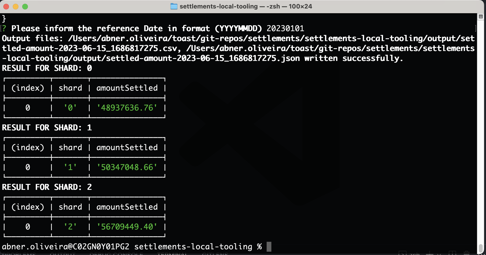

# settlements-local-tooling

Experimental app with some local (~UI and~ console) tooling for the settlements team

The idea is provide a quick way to experiment locally with tooling to automate some of the
day by day tasks of Settlements Team Engineers, allows a quick experimentation and a fast and secure way
to share scripts and other toolings which would help us with our day by day tasks.

## Prototype Solution

### 1. Tooling for execute a given sql query against all the shards which contains CHASE or WORLDPAY configured restaurants

* ✅ MVP: Provide a command line implementation, which will run scripts provided by an sql argument file provided.

* ✅ second version: Have a local knowledge-base scripts in the sql-scripts folder which will allow to select between the scripts the one which will be executed

* ✅ Generate CSV and JSON output files with the result of the scripts execution

* [ ] Add shard brain capability (allow to receive merchant GUID as the query parameter and decide the shard which will be targeted)

* ✅ Add DynamoDB capabilities:
  - DynamoDB scripts
  - Merchant MUID lookup

* [ ] Add ledger inspection capabilities   

* [ ] Add more usable scripts to the repository

* [ ] Provide a graphic UI

## How to use

### Execute SQL Scripts
After cloning the repository:

1. go to the terminal, `cd` into the project directory and execute `yarn install`;
2. configure .env using the .env-template as your template and replace the <TOAST_ORDERS_USERNAME> and <TOAST_ORDERS_PASSWORD> with the credentials to each respective environment
3. execute the console application with `yarn install` to install the Node dependencies
4. To execute scripts, run `yarn start` to run scripts against preprod or `yarn start:prod` to run scripts against the production environment
    > Make sure you are connected to the VPN as the script will connect into the preprod or prod
    toastorder instances
5. select the script you want to execute and press enter...
   
6. inform the arguments for the script
   
7. the terminal will show the response (next version will save the results in a CSV file)
   

### Merchant UUID Lookup

1. Add the submerchant ids and respective vendor types to the `dynamo-scripts/submerchant_ids.csv` file.
2. Make sure the project dependencies are updated: `yarn install`
3. Connect into the aws cli using the `oktoast prod`
4. Execute the muid lookup executing the command `yarn run muidlookup`